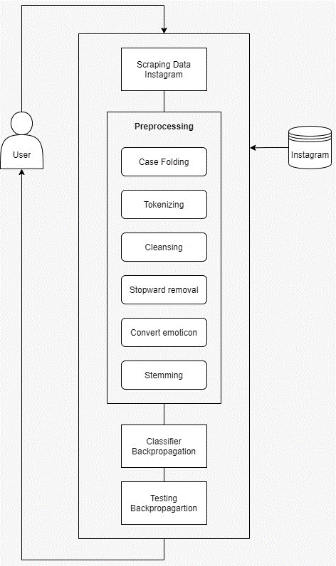

<!-- PROJECT LOGO -->
<br />
  <h3 align="center">Food and Beauty Category Classification In Celebgram
Captions Using Backpropagation Algorithm</h3>

  <p align="center">
    <br />
    <a href="https://www.youtube.com/watch?v=z5d8uWASkZQ&t=6s">System Demo</a>
  </p>

<!-- TABLE OF CONTENTS -->
<details open="open">
  <summary>Table of Contents</summary>
  <ol>
    <li>
      <a href="#about-the-project">About The Project</a>
      <ul>
        <li><a href="#built-with">Built With</a></li>
      </ul>
    </li>
    <li>
      <a href="#getting-started">Getting Started</a>
      <ul>
        <li><a href="#prerequisites">Prerequisites</a></li>
        <li><a href="#installation">Installation</a></li>
				<li><a href="#server-requirements">Server Requirements</a></li>
      </ul>
    </li>
    <li><a href="#flowchart">Flowchart</a></li>
    <li><a href="#license">License</a></li>
    <li><a href="#acknowledgements">Acknowledgements</a></li>
  </ol>
</details>


<!-- ABOUT THE PROJECT -->
## About The Project
Analysis on a huge amount of instagram post captions will take a lot of time when users do a one-by-one analysis related to the topic of food and beauty. To automatically classify instagram post captions without having to identify them one by one to make decisions quickly can be done by using a machine learning-based classification system. Machine learning  had a wide variety of algorithms, such as backpropagation. The classification system of celebgram profile category which was done using backpropagation algorithm received input in caption data form from celebgram profile processed by text mining namely case folding, tokenizing, stop words and  stemming process. After obtaining keywords from the text mining process, they would be calculated with backpropagation which generated output in the form of a categorized celebgram profile. The testing conducted using backpropagation method had been conducted and it could administer the classification of caption categories from celebgram such as food and beauty. The research result shows the accuracy value of the backpropagation method is 96%.

### Built With

* [Python](https://www.python.org/)
* [Bootstrap](https://getbootstrap.com)
* [JQuery](https://jquery.com)
* [Node.js](https://nodejs.org/en/)
* [XAMPP](https://www.apachefriends.org/index.html)


<!-- GETTING STARTED -->
## Getting Started

The following are the steps for installing the project.

### Prerequisites

* pip

  ```sh
  pip install -r requirements.txt
  ```

### Installation

Please see the installation section in <a href="#built-with">Built With</a>.


<!-- SERVER -->
### Server Requirements

PHP version 5.6 or newer is recommended.

It should work on 5.3.7 as well, but we strongly advise you NOT to run such old versions of PHP, because of potential security and performance issues, as well as missing features.

<!-- Flowchart -->
## Flowchart

<p align="center">
	
</p>

<!-- LICENSE -->
## License

Distributed under the MIT License. See `LICENSE` for more information.

<!-- ACKNOWLEDGEMENTS -->
## Acknowledgements
* [GitHub Emoji Cheat Sheet](https://www.webpagefx.com/tools/emoji-cheat-sheet)
* [Img Shields](https://shields.io)
* [Choose an Open Source License](https://choosealicense.com)
* [GitHub Pages](https://pages.github.com)
* [Animate.css](https://daneden.github.io/animate.css)
* [Loaders.css](https://connoratherton.com/loaders)
* [Slick Carousel](https://kenwheeler.github.io/slick)
* [Smooth Scroll](https://github.com/cferdinandi/smooth-scroll)
* [Sticky Kit](http://leafo.net/sticky-kit)
* [JVectorMap](http://jvectormap.com)
* [Font Awesome](https://fontawesome.com)
* [Template](https://github.com/othneildrew/Best-README-Template)
* [Rapid API](https://rapidapi.com/premium-apis-premium-apis-default/api/instagram85/)


<!-- MARKDOWN LINKS & IMAGES -->
<!-- https://www.markdownguide.org/basic-syntax/#reference-style-links -->
[contributors-shield]: https://img.shields.io/github/contributors/othneildrew/Best-README-Template.svg?style=for-the-badge
[contributors-url]: https://github.com/othneildrew/Best-README-Template/graphs/contributors
[forks-shield]: https://img.shields.io/github/forks/othneildrew/Best-README-Template.svg?style=for-the-badge
[forks-url]: https://github.com/othneildrew/Best-README-Template/network/members
[stars-shield]: https://img.shields.io/github/stars/othneildrew/Best-README-Template.svg?style=for-the-badge
[stars-url]: https://github.com/othneildrew/Best-README-Template/stargazers
[issues-shield]: https://img.shields.io/github/issues/othneildrew/Best-README-Template.svg?style=for-the-badge
[issues-url]: https://github.com/othneildrew/Best-README-Template/issues
[license-shield]: https://img.shields.io/github/license/othneildrew/Best-README-Template.svg?style=for-the-badge
[license-url]: https://github.com/othneildrew/Best-README-Template/blob/master/LICENSE.txt
[linkedin-shield]: https://img.shields.io/badge/-LinkedIn-black.svg?style=for-the-badge&logo=linkedin&colorB=555
